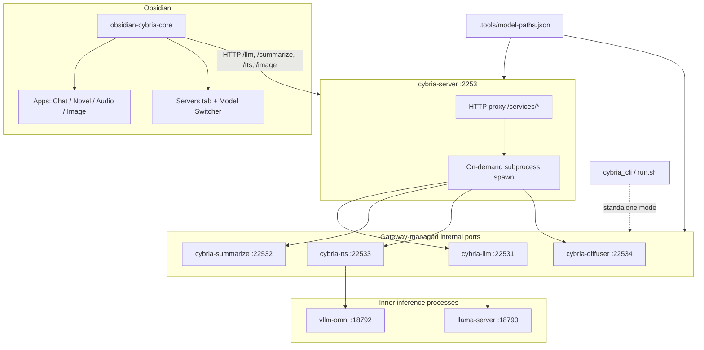

# Architecture — Project Cybria

Expanded reference for the unified Cybria AI stack: Obsidian plugin, Python gateway, on-demand services, and shared model storage.

## Overview

## Component responsibilities

### obsidian-cybria-core (TypeScript plugin)

| Module | Role |
|--------|------|
| `main.ts` | Plugin lifecycle; loads settings; calls `shutdownOnExit` on unload |
| `api.ts` | Facade: service URLs, gateway runner, `startService` / `stopService`, model paths |
| `gateway.ts` | `ensureGatewayRunning()` — launch local gateway or detect external |
| `server-runner.ts` | Spawn Python venv processes; pip install; env injection |
| `servers-panel.ts` | Servers tab UI: launch gateway, per-service Start/Stop/Install |
| `model-switcher.ts` | Load models per slot; poll health; coordinate heavy GPU exclusivity |
| `ModelSwitcherView.ts` | Dashboard / Apps / Servers / Terminal tabs |
| `model-paths.ts` | Portable `%USERPROFILE%\.models`; sync to `.tools/model-paths.json` |
| `clients/*.ts` | Thin HTTP clients for LLM, summarize, TTS, image |

**Entry points (user):**

- Ribbon icon → Cybria AI view
- Settings → Cybria Core (gateway URL, model paths, hardware profile)
- Commands registered in `commands.ts`

### cybria-server (Python gateway)

Single FastAPI app on port **2253**. Does **not** load models itself.

| Responsibility | Implementation |
|----------------|----------------|
| Route public API | `/llm`, `/summarize`, `/tts`, `/image` → reverse proxy |
| On-demand spawn | `POST /services/{name}/start` → subprocess per service |
| Health aggregation | `GET /health` → fan-out to each running service |
| Shutdown | `POST /shutdown` → stop all children, `os._exit(0)` |
| Port cleanup | `_free_port()` before starting a service internal port |
| Log streaming | `_drain_service_logs()` char-by-char with tqdm throttle |

### cybria-llm

FastAPI wrapper around **llama-server** (or `llama_cpp.server`) on inner port **18790**.

- `POST /models/load` → spawns GGUF via `server_launcher.py`
- `GET /health` → `ready` when llama proc running and not mid-load
- `POST /v1/chat/completions` → proxy to inner OpenAI-compatible API
- Readiness probe uses **`/v1/models`** (not `/health`) — see [00-good-shape.md](00-good-shape.md)

### cybria-summarize

Transformers seq2seq (PEGASUS, BART). Loads models on first `/summarize` or `/models/load`.

### cybria-tts

FastAPI wrapper around **vllm-omni** on inner port **18792**.

### cybria-diffuser

Unified Qwen Image + SDXL diffusion. Gateway exposes it as `/image`. Standalone default port **8789**.

### cybria_cli

Cross-platform CLI (`python -m cybria_cli` or `.tools/run.sh`). Setup venvs, run services standalone, download models.

### Model storage

| Layer | File |
|-------|------|
| Obsidian settings | `data.json` → `modelPaths` |
| Python services | `.tools/model-paths.json` (synced on save) |
| Shared library | `.tools/model_paths_lib.py` |

Default root: `%USERPROFILE%\.models` (Windows) or `~/.models` (Unix).

## Data flow

### Starting a service from Obsidian

1. User clicks **Start** on a service card (`servers-panel.ts`).
2. `ensureGatewayRunning()` launches `cybria-server` if needed.
3. `POST /services/{service}/start` → gateway spawns service subprocess on internal port (22531–22534).
4. Gateway `_wait_for_service()` polls service `/health` (HTTP &lt; 500 = success).
5. `ModelSwitcher.activate()` → `POST /models/load` on proxied path.
6. `pollLoaded()` polls until `ready: true` and matching `model_id`.

### Chat / generation request

1. App pane calls `api.ensureModelLoaded(slot)`.
2. HTTP to `http://127.0.0.1:2253/{service}/...` (gateway proxy).
3. Gateway forwards to `127.0.0.1:2253x`.
4. Service may forward again to inner process (LLM → 18790, TTS → 18792).

### Obsidian exit

1. `main.ts` `onunload` → `api.shutdownOnExit()`.
2. Currently: `POST {baseUrl}/shutdown` **unconditionally**, then `stopServer()` if local proc tracked.
3. See [01-critical-shutdown-on-exit.md](01-critical-shutdown-on-exit.md).

## Deployment modes

| Mode | Gateway | Service ports | Typical use |
|------|---------|---------------|-------------|
| **Unified (default)** | 2253 | 22531–22534 internal | Obsidian + `cybria-server` |
| **Standalone CLI** | — | 8790 LLM, 8791 summarize, 8792 TTS, 8789 diffuser | Dev, scripting |
| **External gateway** | Remote URL in settings | Same paths on remote host | Shared dev server |

## Thin spots (architectural)

- Legacy `qwen-image/` and `QWEN_IMAGE_*` env names coexist with `cybria-diffuser` — [11-medium-qwen-image-legacy.md](11-medium-qwen-image-legacy.md), [12-medium-qwen-image-env-rename.md](12-medium-qwen-image-env-rename.md)
- Health semantics differ per service; gateway treats any HTTP &lt; 500 as “up” — [02-high-gateway-start-not-model-ready.md](02-high-gateway-start-not-model-ready.md)
- Inner ports 18790 / 18792 not coordinated between gateway and standalone — [05-high-inner-port-collision.md](05-high-inner-port-collision.md)

## Related reports

- [00-port-map.md](00-port-map.md) — ports and env vars
- [00-good-shape.md](00-good-shape.md) — what already works well
- [README.md](README.md) — full finding index
