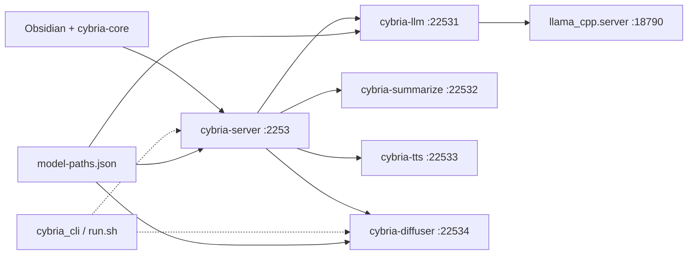

# Project Cybria — Audit (Jul 2026)

**Detailed reports:** [README.md](README.md) — per-finding write-ups with code evidence.

Scan covered `.tools/` Python services, `obsidian-cybria-core`, vault config, and recent session changes (PS1 removal, `cybria_cli`, `cybria-diffuser`, model paths, shutdown, LLM launcher).

---

## Architecture (current state)

**Coherent design:** one gateway, on-demand services, shared model paths, cross-platform CLI. **Thin spots:** legacy `qwen-image/`, config drift between gateway vs standalone, health semantics vs “model ready”.

---

## What’s in good shape

| Area | Status |
|------|--------|
| PS1 removal | Done — `cybria_cli`, `run.sh`, `build-plugins.py` |
| Model paths | Portable `%USERPROFILE%\.models`, sanitization, Python/TS sync |
| `cybria-diffuser` | Unified Qwen + SDXL; gateway wired |
| LLM launcher | `/v1/models` readiness (not `/health`), stdout streaming, better errors |
| Obsidian exit cleanup | `onunload` → `POST /shutdown` + process tree kill on Windows |
| Service cards | Compact layout, pulsing load indicator |
| Logging | Unfiltered terminal output |

---

## Critical

### 1. `shutdownOnExit` may kill a remote/shared gateway

`shutdownOnExit()` always calls `POST {baseUrl}/shutdown` before checking whether **this** Obsidian instance launched the gateway. If **Gateway URL** points at another machine or a shared dev server, closing Obsidian shuts it down for everyone.

**Fix:** Only call `/shutdown` when `isGatewayRunning()` is true (locally spawned).

---

## High

| # | Issue | Where |
|---|--------|--------|
| 2 | Gateway “start OK” ≠ model ready — `_wait_for_service` treats any HTTP &lt; 500 as healthy; LLM `/health` can be 200 while `ready: false` | `cybria-server/server.py` |
| 3 | LLM first load can exceed timeouts (600s inner, 300s switcher poll) on slow GPU | `server_launcher.py`, `model-switcher.ts` |
| 4 | `_free_port()` kills **any** listener on 22531–22534, not only stale Cybria children | `cybria-server/server.py` |
| 5 | Inner ports **18790** / **18792** shared — gateway LLM + standalone LLM can collide | `server_launcher.py`, `cybria-tts` |
| 6 | External gateway: `ModelSwitcher.refresh()` skips health if no local proc → UI shows offline | `model-switcher.ts` |
| 7 | `launchServer()` returns silently when venv missing → 30s generic timeout | `server-runner.ts` |
| 8 | `stopGateway` in UI uses SIGTERM only, not `POST /shutdown` (inconsistent with exit path) | `servers-panel.ts` |
| 9 | `cybria-tts/requirements.txt` missing `vllm` / `vllm-omni` | `cybria-tts/` |
| 10 | TTS `vllm` subprocess stdout never drained → pipe deadlock risk | `cybria-tts/server.py` |

---

## Medium

| # | Issue | Where |
|---|--------|--------|
| 11 | Legacy **`qwen-image/`** folder still present (stub + duplicated code) | `.tools/qwen-image/` |
| 12 | **`QWEN_IMAGE_*`** env names everywhere; should be `CYBRIA_DIFFUSER_*` | gateway, CLI, diffuser, `server-runner.ts` |
| 13 | **`QWEN_IMAGE_MAX_SIDE`**: 512 (gateway) vs 1024 (CLI / check_env) | multiple files |
| 14 | Five duplicate `model_paths.py` wrappers | each service |
| 15 | `ModelSwitcherView` **`onChange` listener never unsubscribed** on `onClose` | `ModelSwitcherView.ts` |
| 16 | Model path changes don’t apply until gateway restart (no warning) | settings + `server-runner.ts` |
| 17 | `sanitizeModelPaths()` silently resets bad roots — UI still shows old path | `model-paths.ts` |
| 18 | Satellite migration not persisted on first load (`migratedFromSatellites` in memory only) | `main.ts`, `migrate-settings.ts` |
| 19 | `cybria-llm` proxy: new `httpx.AsyncClient` per request; non-stream path may leak | `cybria-llm/server.py` |
| 20 | `cybria-summarize` `/health` always `ready: true` before model loaded | `cybria-summarize/server.py` |
| 21 | No gateway launch/stop mutex — double-click races | `gateway.ts`, `servers-panel.ts` |
| 22 | `startService`: service process may stay up if model load fails after `/start` | `servers-panel.ts` |

---

## Low / housekeeping

| # | Issue |
|---|--------|
| 23 | **No project README** — onboarding is code + JSON only |
| 24 | **`reason` plugin enabled** in `community-plugins.json` but **folder missing** |
| 25 | **`web-view` plugin** enabled but incomplete (no `main.js`) |
| 26 | **`obsidian-style-settings`** installed but not enabled; TS SDK still points at it |
| 27 | Dual `.obsidian/` trees (repo root vs vault) — confusing |
| 28 | `model-catalog.json`: some models `integrated: "catalog_only"` |
| 29 | `cybria_cli` `cybria-tts` ServiceSpec `id` typo (`tts` not `cybria-tts`) |
| 30 | No periodic servers-tab refresh during long loads |
| 31 | Unix child-tree kill weaker than Windows `taskkill /T` |

---

## Port map (defaults)

| Port | Role |
|------|------|
| 2253 | Gateway |
| 22531–22534 | Gateway-managed services |
| 8789 | Standalone diffuser |
| 8790–8792 | Standalone LLM / summarize / TTS |
| 18790 | Inner llama-server (collision-prone) |

---

## Recommended fix order

**Immediate (safety + UX)**  
1. Gate `shutdownOnExit` on locally launched gateway  
2. Wire **Stop gateway** through `POST /shutdown`  
3. Fix `ModelSwitcher.refresh()` to always fetch health  
4. Fail fast when venv/python missing (no 30s wait)

**Next sprint (reliability)**  
5. `_wait_for_service`: require `ready: true` in body for LLM/image  
6. Drain TTS vllm stdout; fix TTS requirements  
7. Unsubscribe switcher `onChange` in `onClose`  
8. Persist migration on first `loadSettings`  
9. Free or detect inner port 18790 before llama start

**Cleanup**  
10. Delete or archive `qwen-image/`  
11. Rename `QWEN_IMAGE_*` → `CYBRIA_DIFFUSER_*`  
12. Align `QWEN_IMAGE_MAX_SIDE` defaults  
13. Fix vault plugins: remove/fix `reason`, `web-view`  
14. Add a short root README (setup, ports, `cybria_cli` commands)

---

## Session changes not yet validated end-to-end

These were implemented but still need a full manual pass on your machine:

- LLM load with Qwen 3B (600s timeout; first GPU load can be slow)  
- Obsidian exit → all processes stop  
- Model paths under `%USERPROFILE%\.models`  
- Compact server cards + full terminal logging  

---

I can turn any priority group into patches — say which bucket you want first (shutdown safety, health/LLM load, or legacy cleanup).